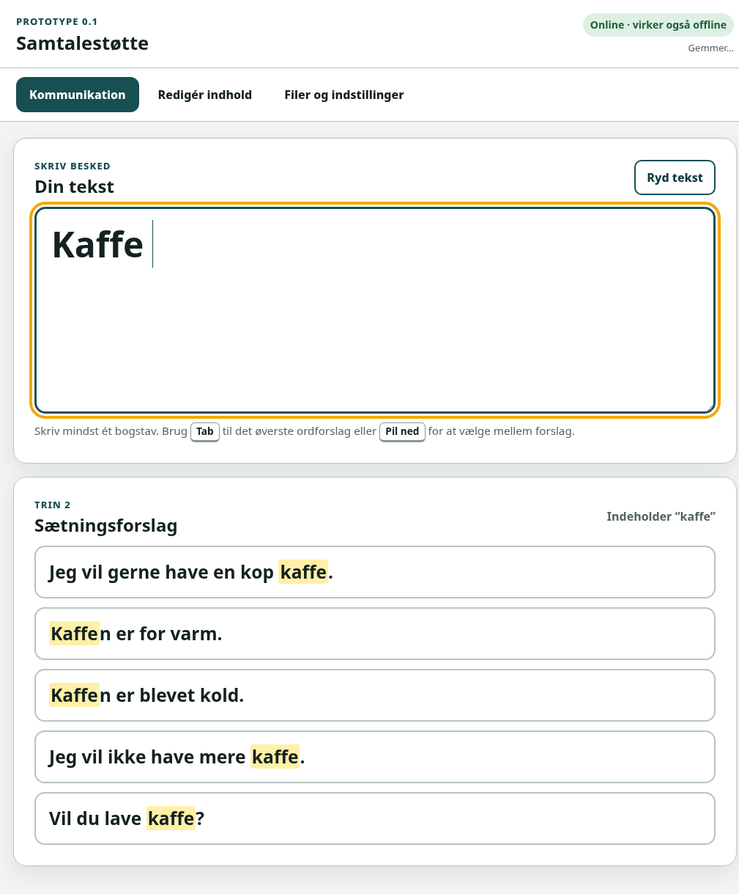

# Samtalestøtte — PWA-prototype 0.1



En enkel, installérbar webapp til tekstbaseret kommunikationsstøtte. Prototypen er lavet til en arbejdsgang med fysisk tastatur:

1. Brugeren skriver begyndelsen af et ord, fx `ka`.
2. Appen viser præfiksbaserede ordforslag, fx `kaffe`, `kage` og `kan`.
3. Når et helt ord vælges eller skrives, viser appen relevante hele sætninger med ordet.
4. Den valgte sætning erstatter teksten i det store skrivefelt og kan læses direkte af samtalepartneren.

Version 0.1 har **ingen tekst-til-tale, ingen generativ AI og ingen faste frasegenveje**.

## Funktioner

- Stor tekst og store trykflader.
- Primær betjening med fysisk tastatur.
- `Tab` indsætter øverste ordforslag.
- `Pil ned` flytter fokus fra skrivefeltet til forslagene.
- Piletaster navigerer mellem forslag; `Enter` vælger.
- Lokal, præfiksbaseret ordprædiktion.
- Sætningsforslag baseret på valgte/skrevne ord og stikord.
- Hyppigt valgte ord og sætninger rangeres gradvist højere.
- Redigering af ord og sætninger direkte i appen.
- Import og eksport som JSON eller semikolonsepareret CSV.
- Automatisk lokal lagring af data og kladde.
- Service worker til offlinebrug efter første indlæsning.
- Ingen konto, analyse eller netværksbaseret behandling af beskedtekst.

## Hurtig lokal test

Kør en lokal webserver i projektmappen:

```bash
python3 -m http.server 8080
```

Åbn derefter:

```text
http://localhost:8080
```

En service worker virker på `localhost` og på HTTPS, men normalt ikke ved at dobbeltklikke direkte på `index.html`.

## Udgivelse med GitHub Pages

1. Opret et nyt GitHub-repository.
2. Pak ZIP-filen ud, og læg **indholdet** af projektmappen i repositoryets rod.
3. Commit og push filerne til fx branchen `main`.
4. Åbn repositoryets **Settings → Pages**.
5. Vælg **Deploy from a branch**, branchen `main` og mappen `/ (root)`.
6. Åbn den GitHub Pages-adresse, GitHub viser, når deployment er færdig.

Projektet kræver ingen buildproces. Filen `.nojekyll` er inkluderet.

### Installation på iPad

1. Åbn GitHub Pages-adressen i Safari.
2. Brug Del-menuen og vælg **Føj til hjemmeskærm**.
3. På nyere iPadOS-versioner aktiveres **Åbn som webapp**, før der trykkes **Tilføj**.
4. Åbn appen fra hjemmeskærmen mindst én gang, mens iPad'en er online, så offlinefilerne kan gemmes.

## Privatliv

Appen sender ikke den skrevne tekst, ordlisten eller sætningsbanken til en server. Redigeringer i appen gemmes i browserlageret på den konkrete enhed.

**Læg ikke personlige, medicinske eller følsomme sætninger ind i et offentligt GitHub-repository.** GitHub Pages-siden kan være offentligt tilgængelig, også når repositoryet ikke er offentligt under visse abonnementer. Behold derfor repositoryet med generiske startdata, og importér den personlige sætningsbank lokalt på iPad'en efter installation.

Browserdata kan blive slettet ved nulstilling, lagerproblemer eller rydning af Safari-data. Eksportér derfor jævnligt en JSON-backup.

## Redigering i appen

Under **Redigér indhold** kan man:

- tilføje, ændre og slette ord;
- give ord en prioritet fra 1 til 100;
- tilføje, ændre og slette sætninger;
- angive stikord manuelt eller lade appen udlede dem;
- give sætninger en prioritet fra 1 til 100.

Når en sætning gemmes, tilføjer appen automatisk dens ord til ordlisten. Prioritet påvirker rækkefølgen, men brugerens faktiske valg påvirker også rangeringen over tid.

## Filformater

### Komplet JSON-backup

Eksportknappen i appen gemmer data, indstillinger og brugsstatistik i ét JSON-dokument. Dette er det anbefalede backupformat.

### Ord som CSV

Semikolonsepareret UTF-8-fil:

```csv
ord;prioritet
kaffe;90
kage;80
kan;75
```

Tilladte kolonnenavne er `ord` eller `word` samt valgfrit `prioritet` eller `priority`.

### Sætninger som CSV

```csv
sætning;stikord;prioritet
Jeg vil gerne have en kop kaffe.;kaffe|drikke|kop;95
Kaffen er for varm.;kaffe|varm;90
```

Tilladte tekstkolonner er bl.a. `sætning`, `saetning`, `sentence`, `tekst` eller `text`. Stikord adskilles med `|`, komma eller semikolon inde i et citeret felt.

Ved import kan indholdet enten flettes med eksisterende data eller erstatte den tilsvarende ord-/sætningsliste.

## Tastaturbetjening i prototype 0.1

| Situation | Tast | Resultat |
|---|---|---|
| Markøren står i skrivefeltet, og ordforslag vises | `Tab` | Indsætter det øverste ordforslag |
| Markøren står i skrivefeltet | `Pil ned` | Flytter til første synlige forslag |
| Et forslag har fokus | Piletaster | Flytter mellem forslag |
| Et forslag har fokus | `Enter` eller mellemrum | Vælger forslaget |
| Et forslag har fokus | `Esc` | Går tilbage til skrivefeltet |

Disse er navigationshandlinger, ikke faste genveje til bestemte ord eller sætninger.

## Automatiske tests

Kræver Node.js:

```bash
npm test
```

Testene dækker præfiksforslag, ordindsættelse, sætningsrangering, dansk CSV-import/-eksport og datafletning.

## Kendte begrænsninger

- Den medfølgende ordliste er kun en generisk startliste og er ikke en komplet dansk ordbog.
- Der er endnu ingen stavefejlskorrektion eller fuzzy matching.
- Tastaturadfærden er testet i en desktopbrowser, men skal valideres på den konkrete iPad og det konkrete tastatur.
- PWA'en er ikke et certificeret medicinsk hjælpemiddel og er ikke klinisk valideret.
- Der er endnu ingen tale, synkronisering mellem enheder eller flerbrugeradministration.

## Næste iteration

Følgende oplysninger bruges til version 0.2:

- iPad-model og iPadOS-version;
- observationer om hvilke taster der er lette eller vanskelige;
- en liste med relevante ord/stikord;
- sætninger knyttet til disse ord;
- ønsket antal synlige ord- og sætningsforslag;
- eventuelle fejltyper på det fysiske tastatur.
